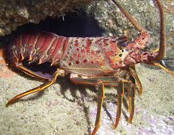

```{r setup, include=FALSE}
knitr::opts_chunk$set(echo = FALSE,
                      message = FALSE,
                      warning = FALSE)
# Attach packages 

library(tidyverse)
library(dplyr)
library(janitor)
library("RColorBrewer")
library(effsize)
library(kableExtra)
library(here)

```

### Introduction
<center>

<br>
California Spiny Lobster *(Panulirus interruptus)* [*(Credit: Catalina Island Marine Institute)*](https://cimioutdoored.org/ca-spiny-lobster/)
</center>
 
### Data and Methods

Data for Spiny Lobster abundance and sizes was collected and provided by The Santa Barbara Coastal Term Ecological Research (SBC LTER) program. Divers measured abundance and size (mm) in summer before the start of fishing season at five sites along the coast of Santa Barbara. The number and size of spiny lobsters at each site were recorded by in four 300m^2 transects (60 x 5 m) at each site. Data collection begin in the summer of 2012 and was collected annually through 2018. 

### Results

```{r, echo=FALSE}

#read in data, clean names to lowercase snakecase, and uncount the count column

lobster_abundance <- read_csv("lobster_abundance_sbc_lter.csv", na = "-99999") %>% 
  clean_names() %>% 
  uncount(count)

      
```

#### 1. Changes in Lobster Abundance by Site

Spiny lobster abundance shows an overall increase at all sites except Arroyo Quemado during the 2012 to 2018 time period. At the Arroyo Quemado reef site there are minor yearly changes in lobster abundance but the population is relatively stable from 2012 to 2018. There is a sharp increase in abundance beginning in 2016 at Carpenteria and Isla Vista, however in 2017 Carpenteria experienced a significant decline in lobster abundance while Isla Vista lobster abundance continued to increase through 2018.  Isla Vista, Naples, and Mohawk reefs all experienced declines in abundance between 2015 and 2016. At Mohawk reef this decline continued until 2018 while lobster abundance at Isla Vista and Naples reef had recovered by 2017 and 2018, respectively. As for 2017 the only two reef sites where lobster abundance was increasing were Isla Vista and Naples, which are both marine protected areas. All three unprotected reef sites show stable or declining lobster abundance in 2018.
<br>
```{r}

# Results A


# Create dataframe for lobster abundance (count) by sample site for each year. Add column to df that indicates MPA status

lobster_yr <- lobster_abundance %>% 
  select(year, site, size_mm) %>% 
  group_by(year, site) %>% 
  count(year, site) %>% 
  rename(count = n) %>% 
  mutate(mpa_status = case_when(
    site %in% c('NAPL', "IVEE") ~ "Marine Protected Area",
    site %in% c("AQUE", "CARP", "MOHK") ~ "Unprotected Area"))

# Create line graph to visulize changes in lobster abundance by site from 2012 - 2018

lobster_palette <- c("#354373", "#F2955E", "#038C8C", "#F27457", "#03658C")

ggplot(data = lobster_yr,
       aes(x = year, y = count)) +
  geom_line(aes(color = site,
                linetype = mpa_status)) +
  guides(color = FALSE) +
  labs(x = "Year",
       y = "Lobster Abundance (individuals)",
       title = "Santa Barbara Lobster Abundance (2012 - 2018)") +
  annotate("text", x = 2018.3, y = 875, label = "Isla Vista", color = "#038C8C") +
  annotate("text", x = 2018.2, y = 500, label = "Carpinteria", color = "#F2955E") +
  annotate("text", x = 2018.3, y = 275, label = "Naples", color = "#03658C") +
  annotate("text", x = 2018.3, y = 135, label = "Mohawk", color = "#F27457") +
  annotate("text", x = 2018, y = 35, label = "Arroyo Quemado", color = "#354373") +
  scale_colour_manual(values = lobster_palette) +
    theme(panel.grid.minor = element_blank(),
          panel.background = element_blank(),
          axis.line = element_line(color = "black"),
          legend.position = c(0.3, 0.7), 
          legend.text = element_text(size = 16),
          legend.key = element_blank(),
          legend.title = element_blank(),
          plot.title = element_text(hjust = .5),
          plot.caption = element_text(hjust = .5))

```
<br>

**Fig. 1** - *Lobster population counts at five sampling sites along the Santa Barbara coast (2012 - 2018).  Lines indicate lobster abundance (count of individuals) at Arroyo Quemado (orange), Carpenteria (yellow), Isla Vista (green), Mohawk (blue), and Naples (purple). Solid lines indicate that survey site is a marine protected area; dashed lines are unprotected sites.*


#### 2. Lobster Size Distribution in 2012 and 2018

Isla Vista and Naples, the reef sites within Marine Protected Areas, saw an overall increase in lobster size for the entire population from 2012 to 2018. The number of lobsters above 80 mm (approximate minimum catch size) increased significantly at Isla Vista between 2012 and 2018. At unprotected reef sites the distribution of size in the lobster populations is relatively unchanged in the same time period and the majority of lobsters in these population are smaller than the minimum catch size. 
<br>
```{r}

# Results B

# Create dataframe of lobster sizes for each site for 2012 and 2018

lobster_size <- lobster_abundance %>% 
  select(year, site, size_mm) %>% 
  filter(year %in% c(2012, 2018)) %>% 
  mutate(year = as.character(year))

lobster_size$site[lobster_size$site == "AQUE"] <- "Arroyo Quemado"

lobster_size$site[lobster_size$site == "IVEE"] <-  "Isla Vista"

lobster_size$site[lobster_size$site == "NAPL"] <- "Naples"

lobster_size$site[lobster_size$site == "CARP"] <- "Carpenteria"

lobster_size$site[lobster_size$site == "MOHK"] <- "Mohawk"

# Create density plot of lobserter sizes for 2012 and 2018 at each sample site

ggplot(lobster_size) + 
  geom_density(aes(fill = year, x = size_mm, color = year),
               alpha = .5) +
  facet_wrap(~site, scales = "free_x") +
  scale_x_continuous(limits=c(20,150)) +
  scale_fill_manual(values = c("#B2182B", "#2166AC")) +
  scale_color_manual(values = c("#B2182B", "#2166AC")) +
  labs(title = "Distribution of Lobster Size in Santa Barbara, 2012, 2018",
       x = "Lobster Size (mm)",
       y = "Density") +
  theme(panel.margin = unit(2, "lines"),
        panel.grid.minor = element_blank(),
        panel.background = element_blank(),
        panel.border = element_blank(),
        axis.line = element_line(colour = "grey"),
        legend.position = "top",
        legend.title = element_blank())

    
```
<br>
**Fig. 2** - *Lobster size distributions for five reef sites in Santa Barbara county in 2012 and 2018.*

#### 3. Comparing mean lobster sizes at MPA vs. non-MPA sites in 2012 and 2018
```{r}

# Results C

# Create a new dataframe that adds MPA status column to lobster size dataframe

mpa_lobster_size <- lobster_size %>%
  mutate(mpa_status = case_when(
    site %in% c("Naples", "Isla Vista") ~ "MPA",
    site %in% c("Arroyo Quemado", "Carpenteria", "Mohawk") ~ "Non MPA"))

```

```{r}
# Create summary df of mean lobster size, sd and sample size for MPA and Non MPA sites for 2012 and 2018 

mpa_mean_size <- mpa_lobster_size %>% 
  group_by(year, mpa_status,) %>% 
  summarize( mean = mean(size_mm, na.rm = TRUE,) %>% round(2),
             sd = sd(size_mm, na.rm = TRUE) %>% round(2),
             sample = n())

```

```{r}
# 1. Determine if there is a significant difference in lobster size between MPA and non-MPA sites in 2012. 

lobster_2012_mpa <- mpa_lobster_size %>% 
  filter(year == 2012, mpa_status == "MPA") %>% 
  pull(size_mm)

lobster_2012_nonmpa <- mpa_lobster_size %>% 
  filter(year == 2012, mpa_status == "Non MPA") %>% 
  pull(size_mm)

# Run 2 sided T Test

ttest_2012 <- t.test(lobster_2012_mpa, lobster_2012_nonmpa)

# Calculate Cohen d to determine effect size

d_2012  <- cohen.d(lobster_2012_mpa, lobster_2012_nonmpa)

# Create statistic for Comparison

mean_mpa_2012 <- mean(lobster_2012_mpa)
mean_nonmpa_2012 <- mean(lobster_2012_nonmpa) 

# Calculate Standard Deviations
sd_mpa_2012 <- sd(lobster_2012_mpa) 
sd_nonmpa_2012 <- sd(lobster_2012_nonmpa) 


# Calculate Sample Sizes
n_mpa_2012 <- length(lobster_2012_mpa)
n_nonmpa_2012 <- length(lobster_2012_nonmpa) 


```
In 2012, lobsters at MPA sites had a mean size of (`r round(mean_mpa_2012, 2)` $\pm$ `r round(sd_mpa_2012, 2)`, n = `r n_mpa_2012`) which differed significantly from mean lobster size in non-MPA sites in 2012 (`r round(mean_nonmpa_2012, 2)` $\pm$ `r round(sd_nonmpa_2012, 2)`, n = `r n_nonmpa_2012`) by a two-sided, two sample t-test (t(`r round(ttest_2012$parameter, 2)`) = `r round(ttest_2012$statistic, 2)`, *p* = `r round(ttest_2012$p.value, 3)`). With a moderate effect size (Cohen's *d* = `r round(d_2012$estimate, 2)`), the difference in mean lobster size in 2012 within MPA sites compared to non-MPA sites is noticeable upon careful review. 

```{r}
# 2. Determine if there is a significant difference in lobster size between MPA and non-MPA sites in 2018.

lobster_2018_mpa <- mpa_lobster_size %>% 
  filter(year == 2018, mpa_status == "MPA") %>% 
  pull(size_mm)

lobster_2018_nonmpa <- mpa_lobster_size %>% 
  filter(year == 2018, mpa_status == "Non MPA") %>% 
  pull(size_mm)

# Run 2 sides T Test

ttest_2018 <- t.test(lobster_2018_mpa, lobster_2018_nonmpa)

# Calculate Cohen d to determine effect size

d_2018  <- cohen.d(lobster_2018_mpa, lobster_2018_nonmpa)

# Create statistic for Comparison

mean_mpa_2018 <- mean(lobster_2018_mpa)
mean_nonmpa_2018 <- mean(lobster_2018_nonmpa) 

# Calculate Standard Deviations
sd_mpa_2018 <- sd(lobster_2018_mpa) 
sd_nonmpa_2018 <- sd(lobster_2018_nonmpa) 


# Calculate Sample Sizes
n_mpa_2018 <- length(lobster_2018_mpa)
n_nonmpa_2018 <- length(lobster_2018_nonmpa) 


```
In 2018 lobsters at MPA sites had a mean size of (`r round(mean_mpa_2018, 2)` $\pm$ `r round(sd_mpa_2018, 2)`, n = `r n_mpa_2018`) which differed significantly from mean lobster size in non-MPA sites in 2018 (`r round(mean_nonmpa_2018, 2)` $\pm$ `r round(sd_nonmpa_2018, 2)`, n = `r n_nonmpa_2018`) by a two-sided, two sample t-test (t(`r round(ttest_2018$parameter, 2)`) = `r round(ttest_2018$statistic, 2)`, *p* = `r round(ttest_2018$p.value, 14)`). With a moderate effect size (Cohen's *d* = `r round(d_2018$estimate, 2)`), the magnitude of the increase in mean lobster size within non-MPA sites compared to MPA sites in 2018 is noticeable.
```

```{r}
# 3. Determine if there a significant difference in lobsters observed in 2012 vs. 2018 for MPA sites only.

# Run 2 sides T Test using pulled values for 2012 mpa sites and 2018 mpa sites

ttest_mpa <- t.test(lobster_2012_mpa, lobster_2018_mpa)

# Calculate Cohen d to determine effect size

d_mpa  <- cohen.d(lobster_2012_mpa, lobster_2018_mpa)


```
In 2012 lobsters at MPA sites had a mean size of (`r round(mean_mpa_2012, 2)` $\pm$ `r round(sd_mpa_2012, 2)`, n = `r n_mpa_2012`) which differed significantly from mean lobster size in MPA sites in 2018 (`r round(mean_mpa_2018, 2)` $\pm$ `r round(sd_mpa_2018, 2)`, n = `r n_mpa_2018`) by a two-sided, two sample t-test (t(`r round(ttest_mpa$parameter, 2)`) = `r round(ttest_mpa$statistic, 2)`, *p* = `r round(ttest_mpa$p.value, 14)`). With a large effect size (Cohen's *d* = `r round(d_mpa$estimate, 2)`), the differnce in mean lobster size between MPA sites in 2012 compared to MPA sites in 2018 is noticeable.

```{r}
# 4. Determine if there is a significant difference in lobsters observed in 2012 vs. 2018 for non-MPA sites.

# Run 2 sides T Test using pulled values for 2012 non mpa sites and 2018 non mpa sites

ttest_nonmpa <- t.test(lobster_2012_nonmpa, lobster_2018_nonmpa)

# Calculate Cohen d to determine effect size

d_nonmpa  <- cohen.d(lobster_2012_nonmpa, lobster_2018_nonmpa)
```
In 2012 lobsters at non MPA sites had a mean size of (`r round(mean_nonmpa_2012, 2)` $\pm$ `r round(sd_nonmpa_2012, 2)`, n = `r n_nonmpa_2012`) which did not differ significantly from mean lobster size in non-MPA sites in 2018 (`r round(mean_nonmpa_2018, 2)` $\pm$ `r round(sd_nonmpa_2018, 2)`, n = `r n_nonmpa_2018`) by a two-sided, two sample t-test (t(`r round(ttest_nonmpa$parameter, 2)`) = `r round(ttest_nonmpa$statistic, 2)`, *p* = `r round(ttest_nonmpa$p.value, 3)`). With a small effect size (Cohen's *d* = `r round(d_nonmpa$estimate, 2)`), the difference in mean lobster size within non-MPA sites in 2012 compared to non-MPA sites in 2018 is not noticible.

**Table 1. Lobster size sample statistics for MPA and Non MPA site in 2012 and 2018.**
```{r}

mpa_mean_size %>% 
  kable(col.names = c("Year", 
                      "MPA Status",
                     "Mean (mm)",
                     "Standard Deviations (mm)",
                     "Sample Size (# of lobsters"),
        caption = 
        ) %>% 
  kable_styling(bootstrap_options = "striped", 
                full_width = F,
                position = "center"
                ) 
```


### Summary

*
*
*

### Reference

Reed D. 2019. SBC LTER: Reef: Abundance, size and fishing effort for California Spiny Lobster (Panulirus interruptus), ongoing since 2012. Environmental Data Initiative. https://doi.org/10.6073/pasta/a593a675d644fdefb736750b291579a0. Dataset accessed 11/17/2019.